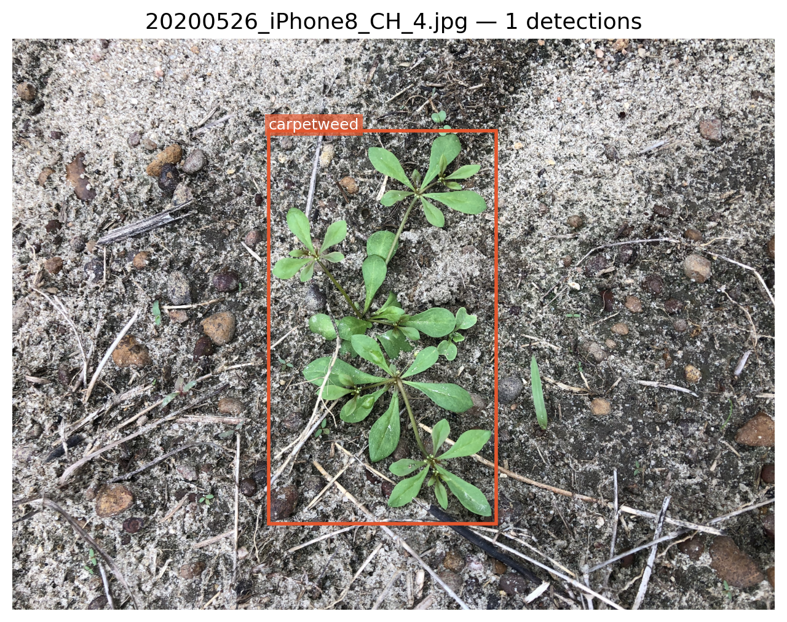
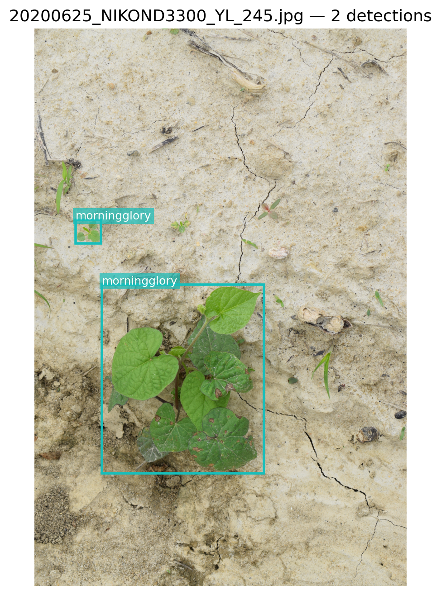
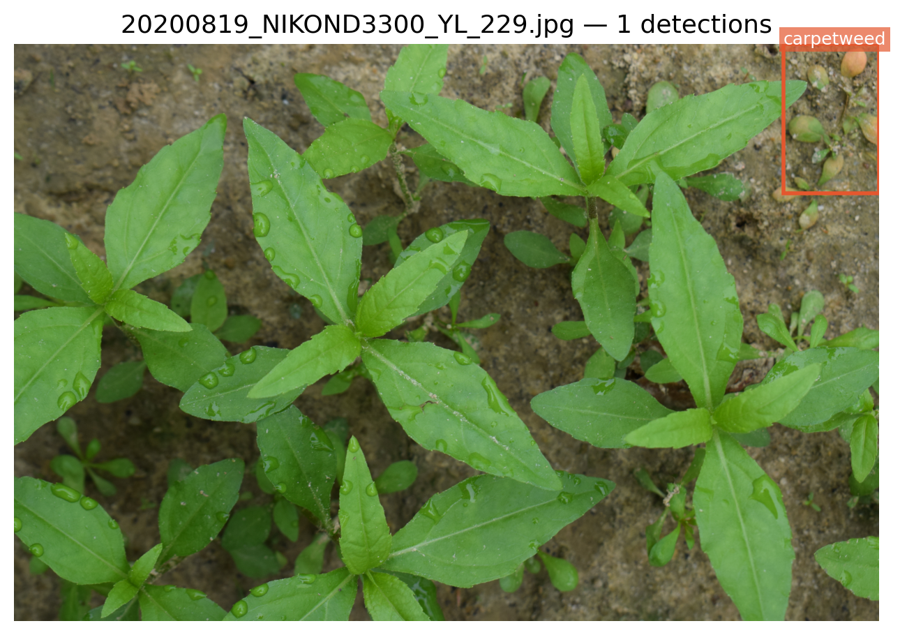
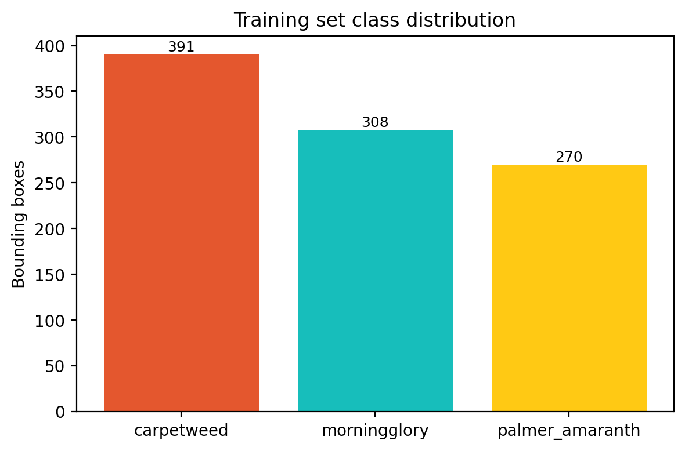

# Cotton Weed Detection (Kaggle) — YOLO

## Visual Preview

| Sample Detection 1 | Sample Detection 2 |
| --- | --- |
|  |  |

| Sample Detection 3 | Class Distribution |
| --- | --- |
|  |  |

> Run `visualize.ipynb` whenever you update the dataset to regenerate the assets in `images/`.

A concise project to detect weeds in cotton fields for the Kaggle "Cotton Weed Detection" challenge using a YOLO object‑detection pipeline.

## Objective
- Build a robust detector that localizes and classifies weeds in aerial/field images to assist crop management and reduce manual inspection.

## Approach
- Use a YOLO-family model (transfer learning) trained on the Kaggle dataset.
- Typical workflow: data cleaning → augmentation → bounding-box training → postprocessing (NMS) → evaluation.

## Data
- Kaggle-provided images and annotations (bounding boxes + labels).
- Apply stratified splits, augmentations (flip, scale, color jitter), and appropriate resizing.
